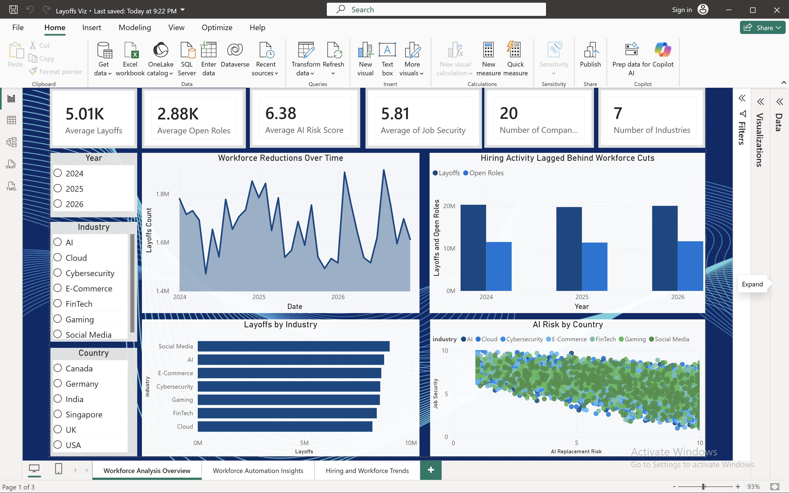
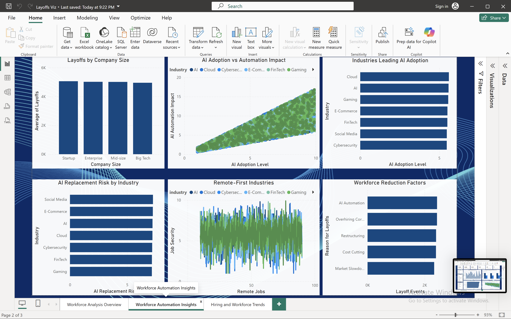

# Tech Workforce & AI IMpact Dashboard

# Introduction & Goals
  This project analyzes workforce transformation trends across the technology industry, with a focus on layoffs, hiring demand, AI adoption, automation impact, and workforce stability from 2024–2026. The goal of the project was to build an end-to-end analytics solution capable of transforming raw workforce data into interactive business intelligence dashboards that provide actionable insights into changing labor market conditions within the tech sector.

  The dataset used in this project contains information related to company layoffs, open roles, hiring demand, AI adoption levels, automation impact, job security, remote work trends, salary budget changes, and workforce reduction drivers across multiple industries and countries. Industries analyzed include AI, Cloud Computing, Cybersecurity, FinTech, Gaming, E-Commerce, and Social Media.
To support the analytics workflow, multiple cloud and business intelligence technologies were used throughout the project lifecycle. Amazon S3 was used as the cloud storage layer for organizing raw and curated datasets. AWS Glue was used to catalog, clean, and transform the raw CSV data into optimized Parquet files for improved query performance. Amazon Athena was then used to query the curated data using SQL, enabling scalable cloud-based analysis without requiring a traditional database server. Finally, Power BI was used to design and develop a multi-page interactive dashboard featuring KPI cards, slicers, trend analysis, scatter plots, treemaps, and comparative workforce visualizations.

  Using these tools, the project explores key questions related to workforce reductions, hiring activity, AI-driven automation risk, and evolving talent market dynamics. The dashboard highlights patterns such as layoffs outpacing hiring demand, industries leading AI adoption, the relationship between AI replacement risk and job security, and the most in-demand technical roles across the market.
Overall, this project demonstrates the complete lifecycle of a modern analytics pipeline, from cloud-based data engineering and transformation to interactive data visualization and executive reporting. The final solution provides a scalable framework for analyzing workforce and labor market trends while showcasing practical skills in cloud technologies, SQL analytics, ETL workflows, and business intelligence development.

# Contents

- [Introduction & Goals](#introduction--goals)

- [The Data Set](#the-data-set)

- [Used Tools](#used-tools)
  - [Amazon S3](#amazon-s3)
  - [AWS Glue](#aws-glue)
  - [Amazon Athena](#amazon-athena)
  - [Power BI](#power-bi)
  - [SQL](#sql)
  - [Python / PySpark](#python--pyspark)

- [Pipeline Components](#pipeline-components)
  - [Connect](#connect)
  - [Buffer](#buffer)
  - [Processing](#processing)
  - [Storage](#storage)
  - [Visualization](#visualization)

- [Pipelines](#pipelines)

- [Demo](#demo)
  - [Architecture Diagram](#architecture)
  - [Power BI Dashboard](#power-bi-dashboard)

- [Conclusion](#conclusion)

- [Follow Me On](#follow-me-on)

- [Appendix](#appendix)

# The Data Set

[Download the Workforce Dataset](data/tech_layoffs_hiring_trends_elite_v2.csv)

[From Kaggle](https://www.kaggle.com/datasets/amaymishra11/tech-layoffs-and-hiring-trends-2026)

The dataset used in this project focuses on workforce transformation trends within the technology industry between 2024 and 2026. It contains information related to layoffs, hiring demand, AI adoption levels, automation impact, job security, salary budget changes, remote work percentages, and workforce reduction drivers across multiple industries and countries.

The dataset includes records from several major technology sectors such as Artificial Intelligence, Cloud Computing, Cybersecurity, FinTech, E-Commerce, Gaming, and Social Media. Key attributes within the dataset include company names, industries, hiring roles, layoff counts, AI replacement risk scores, automation impact ratings, open job roles, and geographic workforce trends.

I chose this dataset because it combines multiple modern workforce topics into a single analytical problem. The relationship between artificial intelligence adoption and workforce disruption is currently one of the most important discussions in the technology industry, making the dataset both relevant and meaningful from a business intelligence perspective. The dataset also provides a strong opportunity to build an end-to-end analytics project that combines data engineering, SQL querying, cloud technologies, and visualization development.

One of the aspects I liked most about the dataset was the variety of dimensions available for analysis. It supports trend analysis across time, industries, companies, and countries while also allowing comparisons between layoffs, hiring growth, automation risk, and AI adoption. This made it possible to create multiple dashboard pages that each tell a different story while still remaining connected within the broader workforce transformation theme.

However, the dataset also presented several challenges. Some columns contained inconsistent or highly aggregated values, which occasionally made comparisons difficult. Certain metrics, such as hiring demand versus layoffs, required careful interpretation because the dataset structure could exaggerate relationships when aggregated improperly. Additionally, some categorical fields contained overlapping or broad labels that required cleaning and transformation before visualization.

The primary objective of this project was to transform raw workforce data into an executive-style analytics dashboard capable of delivering meaningful insights into labor market disruption and AI-driven workforce trends. Beyond visualization, the project was also designed to demonstrate practical cloud analytics skills by building a complete data pipeline using AWS S3, AWS Glue, Amazon Athena, and Power BI. Ultimately, the goal was to create a scalable analytics solution that combines data engineering, business intelligence, and storytelling into a single end-to-end project.

# Used Tools

## Amazon S3
Amazon S3 was used as the cloud storage layer for the project. Raw datasets, curated data, ETL scripts, and Athena query outputs were stored in organized S3 folders. S3 was chosen because it integrates directly with AWS Glue and Athena, making it ideal for building scalable analytics pipelines.

https://aws.amazon.com/s3/

--

## IAM 

IAM roles and policies were configured to allow secure communication between AWS services used throughout the analytics pipeline.

Permissions included:
- AWS Glue access to Amazon S3
- Athena query result access
- Glue crawler permissions
- Data Catalog access

IAM roles were used to ensure secure ETL processing and serverless querying across the pipeline architecture.

https://docs.aws.amazon.com/iam/

---

## AWS Glue
AWS Glue was used for ETL processing and schema cataloging. It transformed raw CSV files into optimized Parquet format and prepared the data for querying in Athena. Glue was chosen because it automates much of the data transformation workflow and integrates seamlessly with other AWS services.

https://aws.amazon.com/glue/

---

## Amazon Athena
Amazon Athena was used as the SQL query engine for analyzing the curated workforce dataset stored in S3. Athena enabled serverless querying without needing to manage a database server. SQL queries were used to analyze layoffs, hiring trends, and AI adoption metrics.

https://aws.amazon.com/athena/

---

## Power BI
Power BI was used to build the interactive dashboard and visualize workforce analytics insights. The dashboard includes KPIs, slicers, scatter plots, treemaps, and trend analysis visuals. Power BI was selected because of its strong business intelligence and reporting capabilities.

https://powerbi.microsoft.com/

---

## SQL
SQL was used within Athena to clean, filter, aggregate, and analyze the workforce data. It allowed efficient exploration of trends across industries, companies, and hiring metrics.

https://www.w3schools.com/sql/

---

## Python / PySpark
Python and PySpark were used within AWS Glue ETL jobs to automate data transformation and convert raw datasets into Parquet format for optimized querying and performance.

https://www.python.org/

https://spark.apache.org/docs/latest/api/python/

## Connect
Amazon Athena was used to connect Power BI to the curated workforce dataset stored in Amazon S3. AWS Glue Data Catalog provided the schema and table definitions required for querying the data.

---

## Buffer
Amazon S3 acted as the buffer and storage layer for the analytics pipeline. Raw CSV datasets, transformed Parquet files, scripts, and Athena query outputs were organized into separate folders within the S3 bucket.

---

## Processing
AWS Glue and PySpark were used to process and transform the raw workforce data. ETL jobs cleaned the dataset, inferred schemas, and converted CSV files into optimized Parquet format for faster querying.

---

## Storage
Amazon S3 served as the primary cloud storage solution for both raw and curated datasets. Using a data lake structure improved scalability and organization throughout the project.

---

## Visualization
Power BI was used to create interactive dashboards and visualize workforce analytics trends. Visuals included KPIs, slicers, scatter plots, treemaps, and trend charts focused on layoffs, hiring demand, and AI adoption.

# Pipelines

This project uses a batch-processing analytics pipeline to transform raw workforce data into an interactive business intelligence dashboard.

The workflow begins by uploading raw CSV workforce datasets into Amazon S3 cloud storage. AWS Glue is then used to crawl, catalog, and transform the raw data into optimized Parquet format for improved performance and scalability. The transformed datasets are stored in a curated S3 layer and queried using Amazon Athena through SQL-based analysis.

Once the curated data is validated in Athena, Power BI connects to the query layer to build interactive dashboards focused on layoffs, hiring demand, AI adoption, automation impact, and workforce trends.

The pipeline architecture was designed to simulate a modern cloud-based analytics workflow by combining:
- Cloud storage
- ETL processing
- Serverless SQL querying
- Interactive data visualization

Additional source code, SQL queries, and ETL scripts used throughout the project are included within the repository folders.

# Demo

## Architecture
![Architecture] (images/LayoffArchitecture.png)

### Amazon S3 Storage

### AWS Glue ETL

### Athena SQL Queries

## Power BI Dashboard

### Workforce Analysis Overview

### Workforce Automation Insights

### Tech Hiring Market Analysis

# Conclusion

This project successfully transformed raw workforce and AI-related data into a complete end-to-end analytics solution using modern cloud and business intelligence technologies. By combining AWS services such as Amazon S3, AWS Glue, and Amazon Athena with Power BI, the project demonstrated how raw datasets can be processed, transformed, queried, and visualized within a scalable analytics pipeline.

The final dashboard provided meaningful insights into workforce transformation trends across the technology industry, including layoffs, hiring demand, AI adoption, automation impact, and workforce stability. Through interactive visualizations and KPI-driven reporting, the project was able to highlight patterns such as layoffs outpacing hiring growth, industries with elevated automation risk, and the growing influence of AI adoption across technical sectors.

One of the most valuable outcomes of this project was the practical experience gained with cloud-based data engineering workflows. The project reinforced key concepts related to ETL processing, schema cataloging, SQL analytics, data lake architecture, and dashboard development. It also strengthened skills in organizing scalable pipelines, optimizing datasets through Parquet formatting, and building executive-style visualizations that communicate insights clearly.

The biggest challenges involved configuring AWS services correctly, managing IAM permissions, troubleshooting Glue and Athena integrations, and ensuring the data structure supported accurate analysis. Additionally, transforming raw workforce data into meaningful business insights required careful interpretation of aggregated metrics and visualization design choices.

Overall, this project provided hands-on experience across the full analytics lifecycle and demonstrated the ability to combine data engineering, cloud technologies, SQL analysis, and business intelligence into a single production-style workflow.

# Follow Me On
http://www.linkedin.com/in/olivia-zama-374417197

# Appendix
- [Amazon S3 Documentation](https://docs.aws.amazon.com/s3/)
- [AWS Glue Documentation](https://docs.aws.amazon.com/glue/)
- [Amazon Athena Documentation](https://docs.aws.amazon.com/athena/)
- [Power BI Documentation](https://learn.microsoft.com/en-us/power-bi/)
- [PySpark Documentation](https://spark.apache.org/docs/latest/api/python/)
